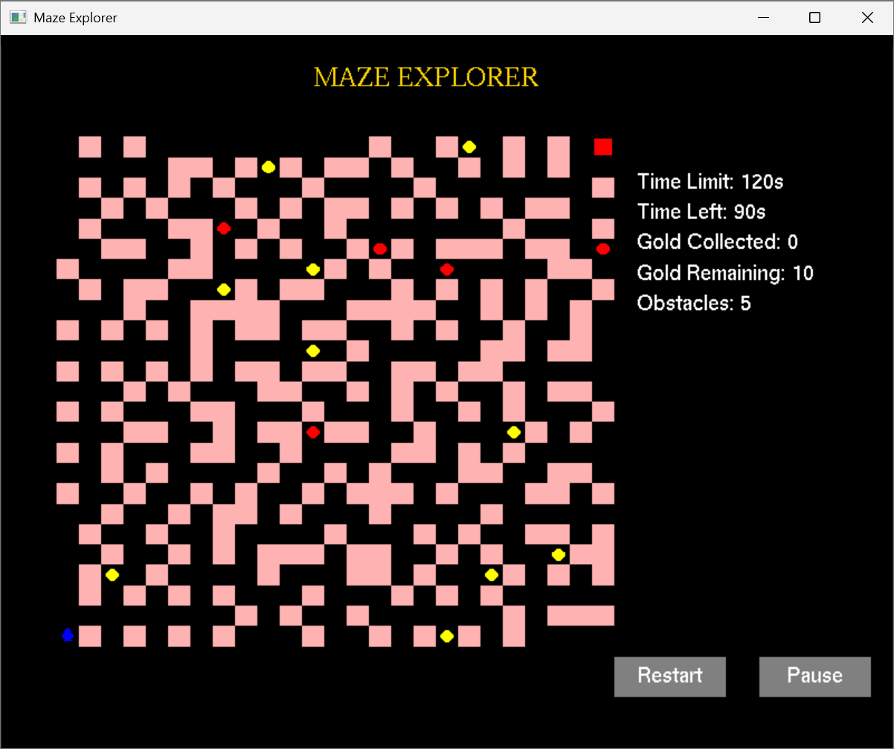

# 🧩 Maze Explorer

A Python-based maze game built using PyOpenGL where the player navigates through a randomly generated maze to collect gold and reach the goal, while avoiding deadly obstacles — all under a countdown timer.

---

## 🎮 Gameplay Features

- ✅ Procedural Maze Generation
- 🟡 Collectible Gold (10 total)
- ❌ Randomized Obstacles (5 total)
- 🔵 Player Movement (Arrow keys)
- ⏸️ Pause and Restart buttons
- ⏱️ 120-second time limit
- 🎉 Win by collecting all gold and reaching the goal
- ❗Lose if time runs out or you hit an obstacle

---
## 🕹️ Controls

| Key / Action      | Description                     |
|-------------------|---------------------------------|
| ⬆️ ⬇️ ⬅️ ➡️         | Move player                    |
| `Enter`           | Collect gold                   |
| `J`               | Remove obstacle (if on it)     |
| `ESC`             | Exit the game                  |
| Mouse Click       | Pause / Restart buttons        |


---
## Maze Game Preview



---
## 🖥️ How to Run

1. ✅ **Install dependencies**:
   ```bash
   pip install PyOpenGL PyOpenGL_accelerate numpy
